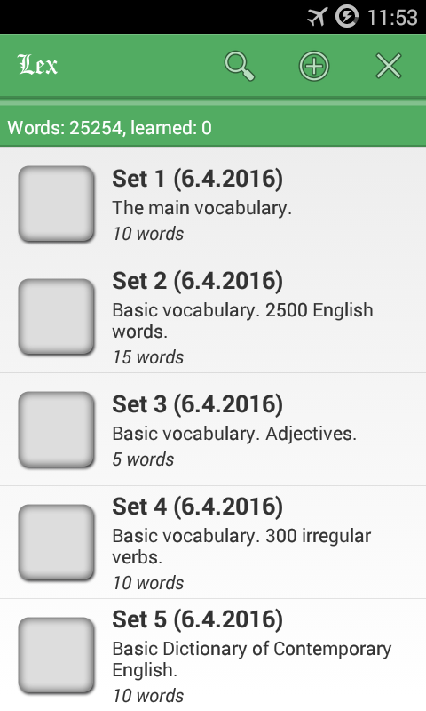
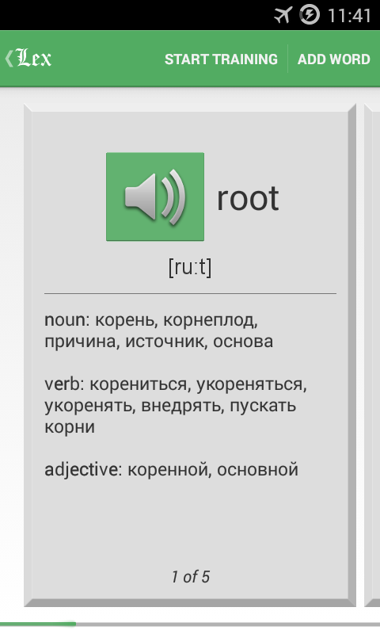
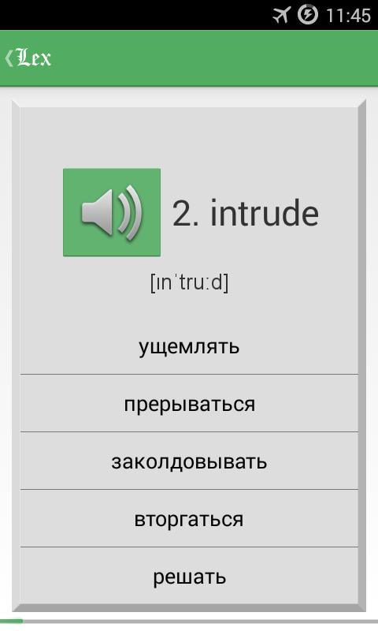
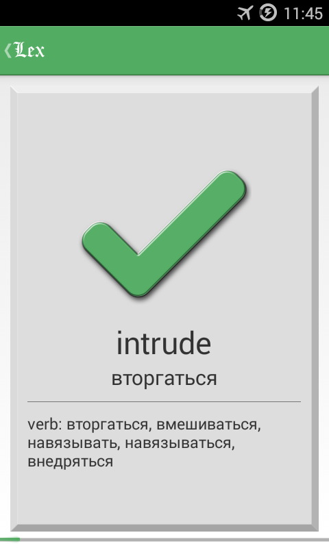
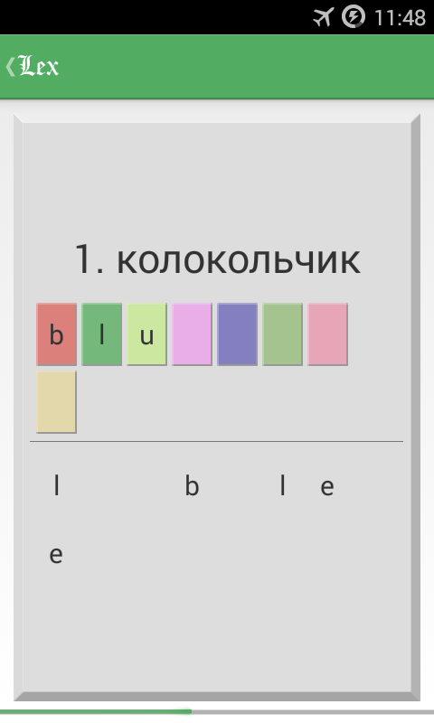
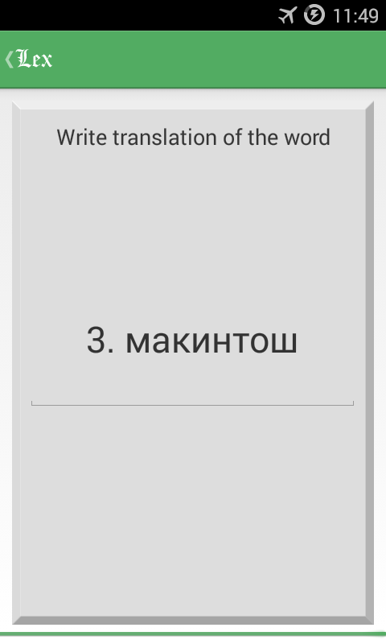

# Lexicon
Android application for learning English words.

  
  
  

<i>Fig. 1: Main window (left), memorization of new words (center) and the first training mode (right).</i>
  

  
  
  

<i>Fig. 2: Some other training modes.</i>
